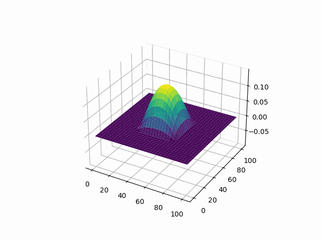

A basic numerical calculus toolbox I am making to gain familiarity with Rust. It supports trapezoidal numerical integration, as well as finite difference numerical differentiation, both in one and two dimensions. It also has support for Euler and RK5 ODE on first-order ODEs, as well as Euler and RK5 on systems of first-order ODEs of arbitrary size.

There is also PDE support, currently 1D and 2D and oriented towards solving wave equations.

